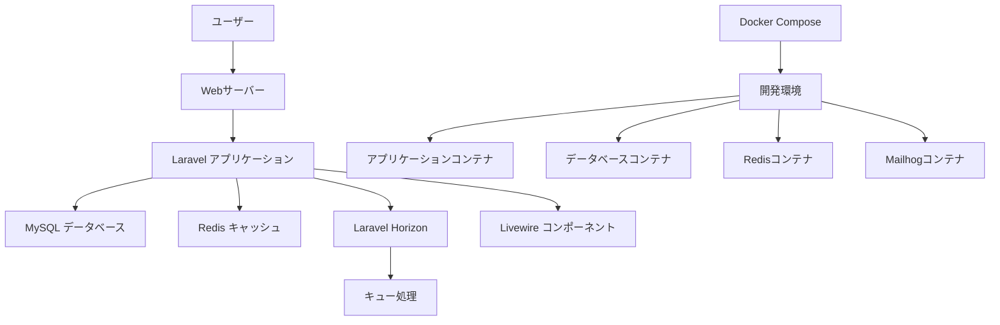
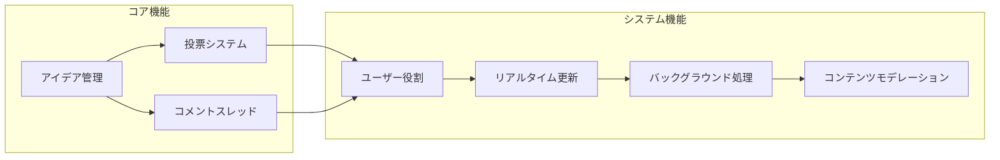
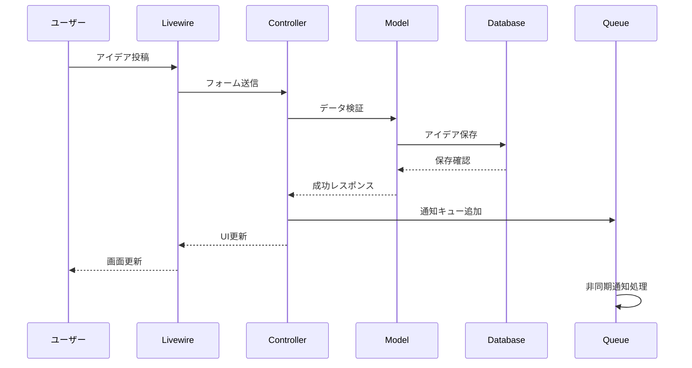

# Voting App with Laravel Sail - システム概要

## 概要

**関連ソースファイル**
* routes/web.php
* composer.json  
* docker-compose.yml

本ドキュメントは、Voting Appの高レベルな概要を提供します。これは、ユーザーがアイデアの投稿、投票、議論を行い、管理者による適切なモデレーション機能を持つLaravelベースのWebアプリケーションです。アプリケーションはLaravel 8、リアクティブUIコンポーネント用のLivewire、コンテナ化開発用のDockerを使用して構築されています。

開発環境のセットアップの詳細については**Getting Started**を、データベース構造とビジネスロジックの詳細については**Core Domain Models**を、フロントエンドアーキテクチャの詳細については**User Interface**をご参照ください。

## 目的と範囲

Voting Appは、ユーザーが以下のことを行えるコラボレーティブプラットフォームです：

* 検討のための新しいアイデアの投稿
* 既存のアイデアへの投票によるサポート表明
* アイデアに対するフィードバックと議論のためのコメント
* アイデアのカテゴリ化と様々な段階でのステータス追跡
* 関心のあるアイデアの活動に関する通知の受信

システムは3つのユーザータイプによる役割ベースのアクセス制御をサポートします：ゲスト（読み取り専用）、登録ユーザー（完全参加）、管理者（コンテンツモデレーションとユーザー管理）。

## システムアーキテクチャ

Voting Appは、開発と本番デプロイメントのためのコンテナ化サービスを持つ現代的なLaravelアーキテクチャに従っています。



## 主要技術スタック

アプリケーションは、リアクティブWebアプリケーション用に最適化された現代的なPHPスタックを活用しています：

| コンポーネント | 技術 | バージョン | 目的 |
|---|---|---|---|
| **フレームワーク** | Laravel | 8.83.29 | コアMVCフレームワークとエコシステム |
| **フロントエンド** | Livewire | 2.12 | JavaScript複雑性なしのリアクティブコンポーネント |
| **データベース** | MySQL | 8.0 | プライマリデータ永続化 |
| **キャッシュ/キュー** | Redis | Latest | セッションストレージ、キャッシング、バックグラウンドジョブ |
| **キュー管理** | Laravel Horizon | 5.20 | キューモニタリングと処理 |
| **認証** | Laravel Sanctum | 2.11 | APIトークン認証 |
| **URL生成** | Eloquent Sluggable | 8.0 | アイデア用のSEOフレンドリーURL |
| **開発** | Laravel Sail | 1.19.0 | Dockerベース開発環境 |

## アプリケーションルートとコントローラー

アプリケーションは、コアユーザーワークフローに沿った焦点を絞ったルートセットを公開します：

```php
// 主要ルート構成
Route::get('/', IdeaIndex::class)->name('idea.index');
Route::get('/ideas/{idea:slug}', IdeaShow::class)->name('idea.show');

// 認証が必要なルート
Route::middleware(['auth', 'verified'])->group(function () {
    Route::get('/ideas', IdeaIndex::class)->name('idea.index');
    Route::post('/ideas', IdeaController::class);
});

// 管理者ルート
Route::middleware(['auth', 'admin'])->prefix('admin')->group(function () {
    Route::get('/dashboard', AdminDashboard::class);
    Route::resource('users', UserController::class);
});
```

## 開発環境

アプリケーションは、必要なすべてのサービスを含む完全な開発環境を提供するためにDocker Composeを使用します：

```yaml
version: '3.8'

services:
  laravel.test:
    build:
      context: ./vendor/laravel/sail/runtimes/8.1
    image: sail-8.1/app
    extra_hosts:
      - 'host.docker.internal:host-gateway'
    ports:
      - '${APP_PORT:-80}:80'
    environment:
      WWWGROUP: '${WWWGROUP}'
      LARAVEL_SAIL: 1
    volumes:
      - '.:/var/www/html'
    networks:
      - sail
    depends_on:
      - mysql
      - redis

  mysql:
    image: 'mysql/mysql-server:8.0'
    ports:
      - '${FORWARD_DB_PORT:-3306}:3306'
    environment:
      MYSQL_ROOT_PASSWORD: '${DB_PASSWORD}'
      MYSQL_DATABASE: '${DB_DATABASE}'
    networks:
      - sail

  redis:
    image: 'redis:alpine'
    ports:
      - '${FORWARD_REDIS_PORT:-6379}:6379'
    networks:
      - sail

  horizon:
    build:
      context: ./vendor/laravel/sail/runtimes/8.1
    command: php /var/www/html/artisan horizon
    volumes:
      - '.:/var/www/html'
    networks:
      - sail
    depends_on:
      - mysql
      - redis

  mailhog:
    image: 'mailhog/mailhog:latest'
    ports:
      - '${FORWARD_MAILHOG_PORT:-1025}:1025'
      - '${FORWARD_MAILHOG_DASHBOARD_PORT:-8025}:8025'
    networks:
      - sail

networks:
  sail:
    driver: bridge
```

開発スタックには、キュー処理用の専用コンテナ（`horizon`）とメールテスト用（`mailhog`）が含まれており、外部依存関係なしでフルスタック開発を可能にします。

## 主要機能概要

Voting Appは、相互に接続されたいくつかのシステムを実装しています：

### 機能構成図



### 機能詳細

* **アイデア管理**: アイデアの投稿、カテゴリ化、ステータスワークフローを通じた追跡
* **投票システム**: 重複防止機能付きのアイデアへの投票
* **コメントスレッド**: スパム報告機能付きのネストされた議論
* **ユーザー役割**: ゲストアクセス、認証ユーザー、管理者権限
* **リアルタイム更新**: Livewireによるリアクティブなui更新
* **バックグラウンド処理**: キューベースのメール通知とメンテナンスタスク
* **コンテンツモデレーション**: ユーザーとコンテンツ管理のための管理者ツール

### データフロー図



アプリケーションは、堅牢なバックエンド処理をLaravelのHorizonで管理されるキューシステムを通じて維持しながら、Livewireのリアクティブコンポーネントを通じてユーザーエクスペリエンスを重視しています。

## 技術的ハイライト

### Laravel Sail
- Dockerベースの開発環境
- ワンコマンドでのセットアップ
- 本番環境との一貫性

### Livewire
- サーバーサイドレンダリング
- JavaScriptフレームワークなしのリアクティブUI
- Laravel統合の最適化

### Queue & Horizon
- 非同期タスク処理
- リアルタイムモニタリング
- スケーラブルなジョブ管理

このアーキテクチャにより、スケーラブルで保守しやすい、ユーザーフレンドリーなアプリケーションが実現されています。
